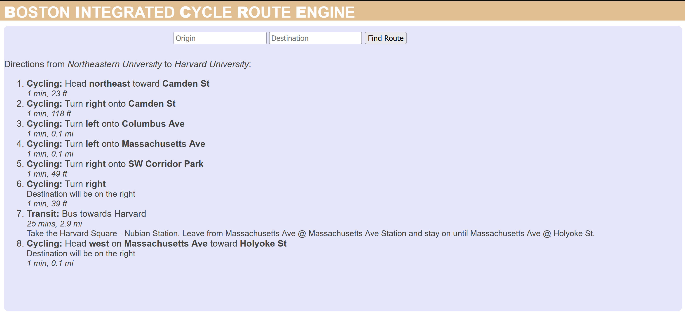

# Welcome to B.I.C.R.E (Boston Integrated Cycling Route Engine)!
## What is Bicre?
Bicre is a simple application which generates an integrated (cycling and transit) route between two locations in Boston. Simply enter the desired origin and destination, and Bicre will create and display a route that uses both cycling and available transit to get between the origin and destination.
## How does it create these routes?
Bicre extends Google's Directions API, calculating a feasible transit route and adding cycling directions to get from the origin to the first transit station and from the last transit station right to the doorstep of the destination! 
Bicre also takes into account the rules, regulations, and alerts provided by the MBTA about bringing a bike on transit.
## Why is Bicre important?
In order to facilitate augmentation of our overall transportation systems, integrated routes are an integral piece of the solution. Being able to ride to transit increases the catchment area of transit stations, improving the amount of people they can serve and improving their efficiency. 
Currently, Google Maps Directions do not have functionality to create integrated transit routes, only considering the option to walk to and from transit, decreasing the accesiblity of our transit systems.
In countries where public transit has a larger share of the modal split (overall view of how people move around) than the United States, cycling to transit stations is commonplace because of existing infrastructure, ease of route setting, and the overall design of the public transit system.
Bicre aims to make it easier for people to enjoy the benefits of combining cycling and transit as an option to get to and from where they are going.
## What is planned for the future of BICRE?
The current version is an MVP and as such many improvements can be made, such as:
  * Improving UI to add more information about route directions
  * Increasing customizability of routes, such as preferences for modes of travel
  * Addressing shortcomings of the MBTA API (e.g. no current way to query amount of bikes on a bus rack)
  * Adding ability for additional waypoints along the route
  * More to come! :D

## What does the current version of BICRE look like?
For the MVP, the focus was on the backend integration of Google and MBTA APIs. As such, less focus was placed on the frontend feel. In the future, there will be an interactive map displaying the route segments and further information about the integrated route!

Below shows the integrated route generated by BICRE between Northeastern University and Harvard University:

